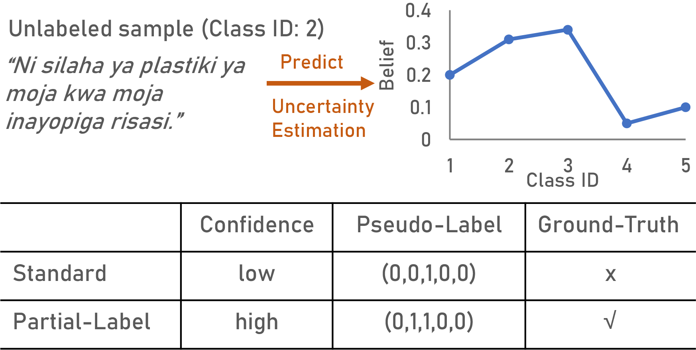

# Uncertainty-Aware Cross-Lingual Transfer with Pseudo Partial Labels

This repository contains the code and data for our NAACL 2022 paper:

[*Uncertainty-Aware Cross-Lingual Transfer with Pseudo Partial Labels*](https://aclanthology.org/2022.findings-naacl.153.pdf)

If you find this work useful and use it on your own research, please cite our paper.

`````
@inproceedings{lei-etal-2022-uncertainty,
    title = {Uncertainty-Aware Cross-Lingual Transfer with Pseudo Partial Labels},
    author = {Lei, Shuo  and
      Zhang, Xuchao  and
      He, Jianfeng  and
      Chen, Fanglan  and
      Lu, Chang-Tien},
    booktitle = {Findings of the Association for Computational Linguistics: NAACL 2022},
    month = jul,
    year = {2022},
    publisher = {Association for Computational Linguistics},
    pages = {1987--1997},
}
`````

### Overview
In this work, we propose an uncertainty-aware Cross-Lingual Transfer framework with Pseudo-Partial-Label (CLTP) to maximize the utilization of unlabeled data by reducing the noise introduced in the training phase.
To estimate pseudo-partial-label for each unlabeled data, we propose a novel estimation method, considering both prediction confidence and the limitation to the number of similar labels.

The figure gives an illustration of our method. 
For an unlabeled sample with ambiguous predictions, the standard one-hot-labeling takes the class
with the highest confidence as the pseudo-one-hot-label, introducing the noise in the training phase due to the
wrong prediction. Instead of choosing one among the predictions that all have low confidence, the proposed
partial-labeling method takes both ambiguous classes as candidate labels, allowing the ground-truth label to
be presented in the training phase.



### Data

We ran experiments on a total of 15 languages. You may download data file by running the following commands and put the data files under `download/` folder.

```
cd bin
sh download_data.sh
```

### Quickstart
After you have finished configuring the `download/` folder, you can run our model with the following commands. 
```
cd bin
sh xnli.sh
```
You can also adjust the model by modifying the parameters in the `experiments.conf` file.

### Dependencies
- Python 3.7
- PyTorch 1.9.1
- transformer 4.17.3
- numpy 1.19.1
- tqdm 4.62.3
- CUDA 11.4
